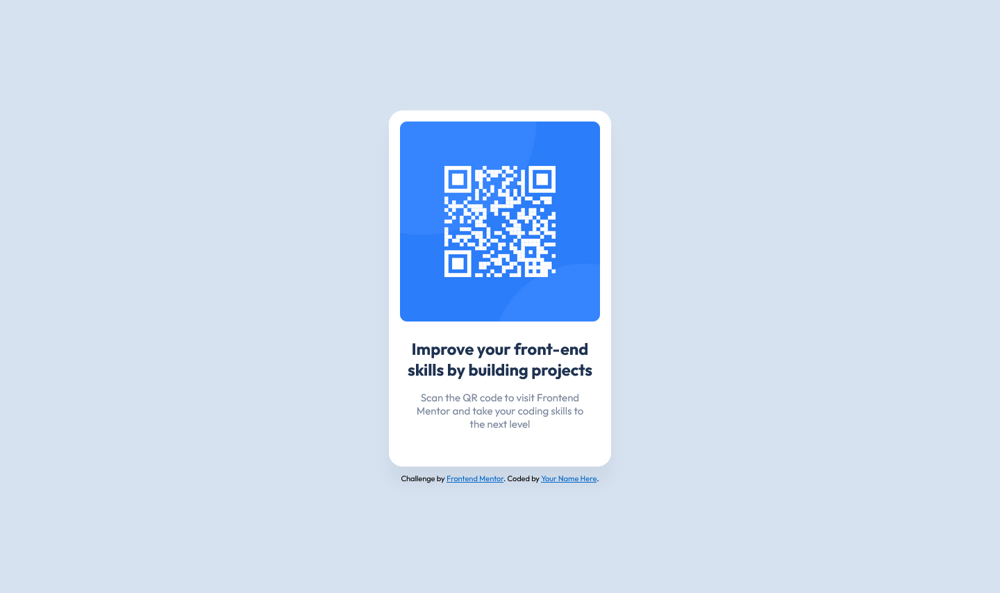

# Frontend Mentor - QR code component solution

This is a solution to the [QR code component challenge on Frontend Mentor](https://www.frontendmentor.io/challenges/qr-code-component-iux_sIO_H). Frontend Mentor challenges help you improve your coding skills by building realistic projects. 

## Table of contents

- [Overview](#overview)
  - [Screenshot](#screenshot)
  - [Links](#links)
- [My process](#my-process)
  - [Built with](#built-with)
  - [What I learned](#what-i-learned)
  - [Continued development](#continued-development)
  - [Useful resources](#useful-resources)
- [Author](#author)


## Overview

### Screenshot





### Links

- Solution URL: [Github](https://github.com/jbuast/qr-code-component-main.git)
- Live Site URL: [Github Page](https://jbuast.github.io/qr-code-component-main/)

## My process

### Built with

- Semantic HTML5 markup
- CSS custom properties
- Flexbox
- CSS Grid
- SASS
- Mobile-first workflow

### What I learned

I learned how to use SASS and make my code more clean. To use semantic HTML and using mixins.

My learnings to this challenge, see below:

```html
<body>
  <main>
    
    <h1>Improve your front-end skills by building projects</h1>
    <p>Scan the QR code to visit Frontend <br>Mentor and take your coding skills to<br> the next level</p>
  </main>

  <footer>
    <div class="attribution">
      Challenge by <a href="https://www.frontendmentor.io?ref=challenge" target="_blank">Frontend Mentor</a>. 
      Coded by <a href="#">Your Name Here</a>.
    </div>
  </footer>
</body>
```
```css
@mixin size($width, $height){
    width: $width;
    height: $height;
}
```

### Continued development

I want to properly utilize the uses of html and css. I will continue to build more project using html and css until I am good at it. 


### Useful resources

- [MDN Web Docs](https://developer.mozilla.org/en-US/) - This helped me understand and guides me by providing comprehensive documentation on web development technologies such as HTML and CSS.
- [ChatGPT](https://chat.openai.com/) - This is very helpful to me. It is like a mentor because it can explain to you the block of codes.


## Author

- Website - [Github Page](https://jbuast.github.io/qr-code-component-main/)
- Frontend Mentor - [@jbuast](https://www.frontendmentor.io/profile/jbuast)


